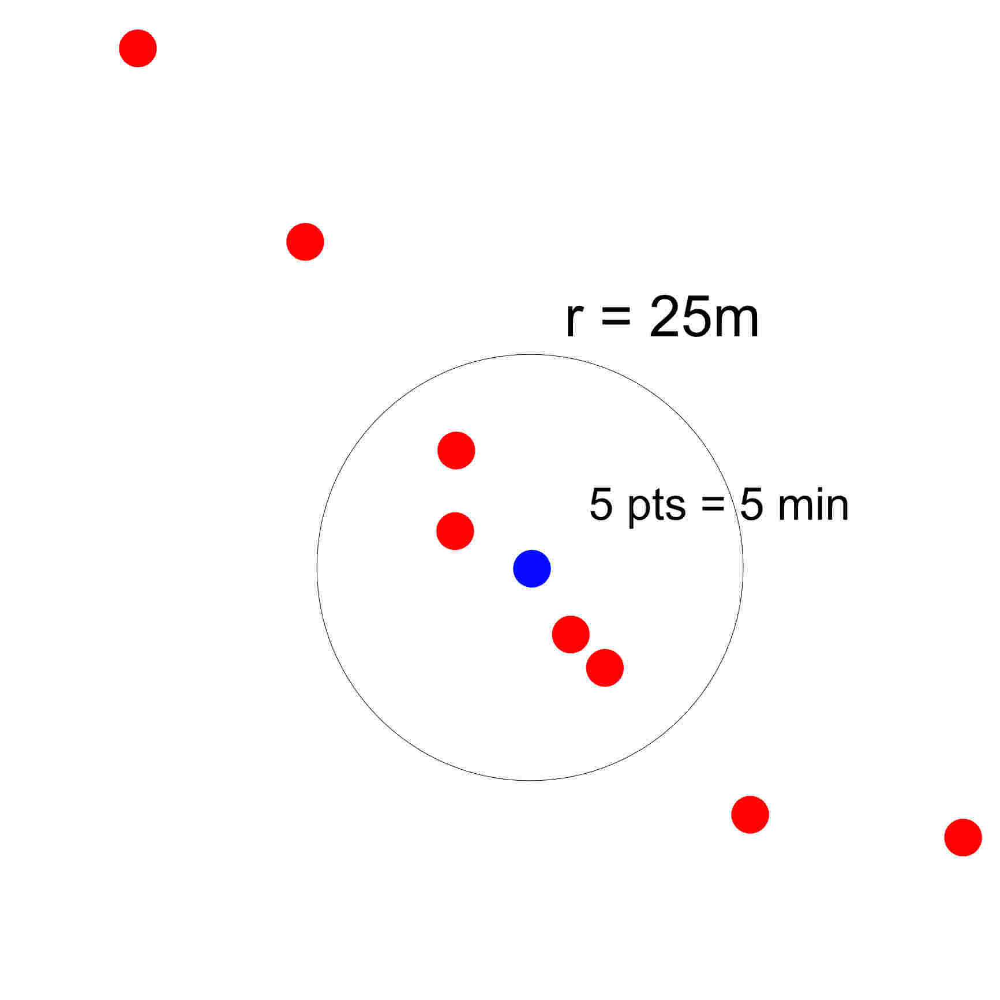
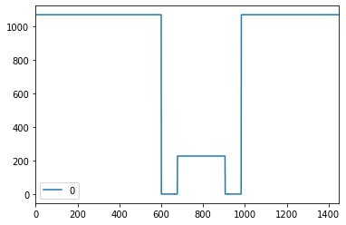
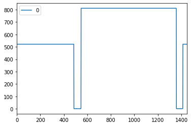
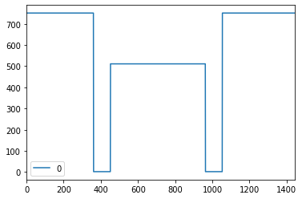

#### 1107 松本
##### 進捗報告

- 現在、停留点の抽出の定義づけ部分を行っている。
  - 区域を広げたため、通過サンプルも含め、関連するサンプルが増えたので、ランダムサンプリングを行い、サンプル数を減らすことで、停留点の定義づけを行う。
  - 下図のように全ポイント(17551サンプル)で抽出するのは時間がかかりすぎて現実的な作業ではないことが判明

    - まず設定区域を通過も含めたサンプルを抽出
    - 次にサンプルの1%をランダムに抽出する（この数字は抽出率は総サンプル数による）
      - そのため現在は設定区域でのサンプル抽出を行っている。
        - その後1.4万サンプルになったため、1%のランダムサンプルを行い、140サンプルで定義づけを行う

---

- 既往研究のサンプル時空間ポイントデータでの既往研究を見つけたので、追加予定

---
- WebAPIについて、2011年の既往研究では使われているが、人の流れデータサイトでAPIの問い合わせについて答えられないと書いてあるため、実質利用ができない
- →秋山先生か担当研究室（関研究室）に問い合わせ？

---
- 中京圏サンプル時空間ポイントデータは約25万人
- そのうち提供されているサンプル数は約1.6万人
-
