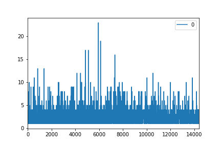
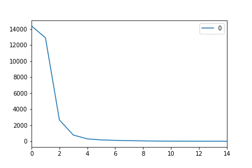
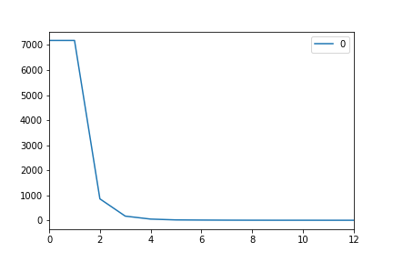
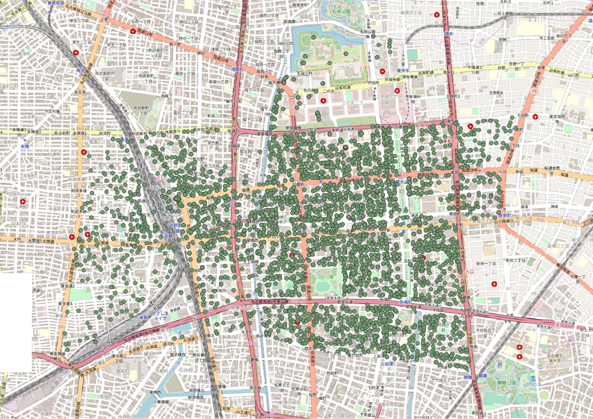

#### 1114 松本
##### 進捗報告

停留点抽出の概念図

全ての点から半径25mの円を作成し、その内部の点をカウントする。
このカウント数が5つ以上の場合、25m圏内に5分以上滞在したとし、その25m圏内の点を全て抽出する。
抽出された点のうち、時刻が最も早い点を**停留スタート点**、時刻が最も遅い点を**停留エンド点**として、定義する。
この時、停留スタート点は域内トリップのトリップエンドとなり、停留エンド点は域内トリップのトリップスタートとなる。

対応表
|トリップ |停留  |
|---|---|
|域内トリップスタート点  |停留エンド点  |
|域内トリップエンド点  |停留スタート点  |

停留スタート点、停留エンド点を抽出する際、その時刻と緯度経度を記録し、停留時間とトリップ距離の分析に用いる。

---
ここで全サンプル数と域内サンプル数の整理を行う。
域内データは、中区を含めた区域で一度でも停留したサンプルのことである。
|トリップ |停留  |
|---|---|
|全サンプル数  |17551  |
|全停留サンプル数   |14398   |
|域内停留サンプル数  |6326  |
---

全サンプルにおける停留回数
縦軸：停留回数、横軸：サンプルID

---
全サンプルにおける停留回数
縦軸：サンプルID数、横軸：停留回数

---
各域内トリップとサンプル数
|域内トリップ |域内停留サンプル数  |域内停留サンプル数/総サンプル数(7182) |
|---|---|---|
|第1域内停留点数  |7182  |1 |
|第2域内停留点数  |856   |0.119 |
|第3域内停留点数 |166  |0.0231 |
|第4域内停留点数   |48   |0.00668 |
|第5域内停留点数 |15  |0.00209 |
|第6域内停留点数   |9   |0.00125 |
|第7域内停留点数   |5   |0.000696 |
|第8域内停留点数   |3   |0.000418 |
|第9域内停留点数   |2   |0.000278 |
|第10域内停留点数   |2   |0.000278 |
|第11域内停留点数   |1   |0.000139 |
|第12域内停留点数（最大）   |1   |0.000139 |

停留点の分布

---
停留点の分布

---

#### ぐるなびデータの整理
- 全データ数　13688店舗
- 域内データ数　4515店舗
- 全データの時間を提供されている店舗は5755店舗（域内では2538店舗:1932店舗分不足）
  - 課題：ナイトエコノミーの分析をする際、2538店舗分でしか行えない

店舗の分布

#### スケジュール
11月4週目：中京都市圏PT調査との付き合わせ,ぐるなびデータを時間帯別に分けるq
11月5週目：ぐるなびデータを時間帯別に分ける（1932店舗分を人力で埋める？）
12月1週目：商業集積地データ、建物現況調査データを整理する（カテゴリーに分ける）
12月2週目：メッシュと停留点と商業集積地データを対応させる（同一店舗数を決める）
#### ここまでで8章まで終了

12月3週目：各トリップでの多項ロジット分析（サンプル数を100程度までにランダムサンプリングしたい）
