

多項ロジット選択モデルを用いたメッシュ選択行動シミュレーションでの人工社会を目指して

ー名古屋市中区を対象としてー

## 章構成

#### 1. 背景と目的
  1. 背景
       　名古屋市には様々な商業施設、娯楽施設、飲食店が存在し、多様な人々が来訪することで、都市への賑わいをもたらす。近年では人々の移動に関する情報はGPSログデータをはじめとするデータが提供されており、人々の行動がより詳細に得られるようになった。人々の店舗選択行動を構築することで、都心での店舗間の往来を明らかにし、都市の賑わい形成に繋がると考える。
  2. 目的
  3. 既往研究
     1. サンプル時空間ポイントデータにおける既往研究
        1. Jorasから参照
     1. 店舗選択モデルの既往研究
        1. 兼田研究室でのモデル、桜井モデル、石橋モデル

#### 3. サンプル時空間ポイントデータの性質
  1. サンプル時空間ポイントデータの基本性質
     1. 基本的統計量
        - [x] 全サンプルの停留回数
        - [x] 全サンプルの停留時間
        - [x] 全サンプルの停留日時
        - [ ] 域内サンプルの停留回数
        - [ ] 域内サンプルの停留時間
        - [ ] 域内サンプルの停留日時

     2. 空間分布
        - [x] 域内サンプルの停留点の空間分布
        - [x] 域内サンプルの停留回数の空間分布
        - [x] 域内サンプルの各滞留時の停留時間の空間分布
        - [x] 域内サンプルの停留日時の空間分布

### 【サンプル時空間ポイントデータを用いた分析】

#### 4. サンプル時空間ポイントデータにおける停留点の抽出
目的: 停留点をPT調査との付き合わせ、停留時間と各トリップ数との関係から推定し、回遊行動分析への可能性を探る
  1. PT調査との関係（中京圏PT調査報告書から引用）
     - [ ] PT調査の時間帯別区別目的割合
     - [ ] PT調査の細区分のODとサンプル時空間ポイントデータのOD数の関係
     - [ ] PT調査の目的の比率
     - [ ] PT調査の時間帯比率
  2. 滞留時間と歩行者数数の関係
     - [x] サンプルからのグラフ
  3. 滞留の定義付け
  4. 各トリップごとの歩行者数
     - [x] 全域トリップの各トリップごとの歩行者数
     - [ ] 域内トリップの各トリップごとの歩行者数

#### 5.サンプル時空間ポイントデータの分析

### 【飲食店・娯楽施設ポイントデータを用いた分析】

#### 6. サンプル時空間ポイントデータの性質
  1. ぐるなびデータの基本性質
     1. 入手方法
     2. 基本的統計量
        - [ ] 時間帯のヒストグラム
        - [ ] カテゴリーのヒストグラム
     3. 空間分布
        - [ ] 時間帯の空間分布
        - [ ] カテゴリーの空間分布
     4. デイタイムとナイトタイム店舗の分類
     5.
  2. 商業集積統計データの基本性質
     1. 入手方法
     2. 基本的統計量
        - [ ] カテゴリーのヒストグラム
     3. 空間分布

  3. 建物現況調査データの基本性質
     1. 入手方法
     2. 基本的統計量
        - [ ] カテゴリーのヒストグラム
     3. 空間分布
        - [ ] カテゴリーの空間分布

#### 7. 全飲食店・娯楽施設の分類

#### 8. 多項ロジットモデルを用いたメッシュ選択分析
  1. 多項ロジット選択モデルの概要
    1. 多項ロジットモデル式
    2. 多項ロジットに使うデータベース
    3. 対数最尤法によるパラメータ推定（準ニュートン法など）
    4. 域内トリップへの拡張
  2. 多項ロジット選択モデル分析
     1. データのクリーニング
     2. 各域内トリップのパラメータの推定結果
     3. 各パラメータの妥当性の評価
  3.  デイタイムとナイトタイムでのパラメータの違い

#### 9. 考察
  1. 考察とシミュレーター開発への展望

#### 参考文献
1. 櫻井 雄大, 宮崎 慎也, 藤井 明, 多項ロジットモデルを用いた商業集積地に対する選択行動モデルの構築と商圏の分析, 都市計画論文集, 2011, 46 巻, 3号, p.427-432
2. 池谷 直樹, 谷本 潤, 萩島 理, 相良 博喜, マルチエージェント・シミュレーションに基づく都心部における人口分布の過渡的動態モデルに関する研究, 日本建築学会技術報告集, 2007, 13 巻, 26 号, p. 845-848
3. 正光 将大, 兼田敏之, ダイナミックシミュレータを用いた中心商業地の持続性のシミュレーション分析, 名古屋工業大学卒業論文, 2014
4. 小嶋陽介, 兼田敏之, 名古屋圏における小売構造のモデル分析, 名古屋工業大学修士論文, 2011
5. 兼田敏之, 吉田琢美, 歩行者回遊行動のエージェントモデリング, オペレーションズリサーチ12月号
6. 石橋健一, 斎藤参郎, 熊田禎宣, 来街頻度に基づく販売額予測非集計回遊マルコフモデルの構築-小倉都心商業地区への適用-, 都市計画学会学術研究論文集, 1998,  第33回
7. 島崎 康信, 関本 義秀, 柴崎 亮介, 秋山 祐樹, 人の流れによる時間帯別人口と店舗数との相関関係についての研究-パーソントリップ調査の時空間内挿データと国勢調査データとの比較分析, 都市計画学会論文集, 2009, 44巻, 3号, p.781-786
8. Yoshihide Sekimoto, Ryosuke Shibasaki, Ryosuke Shibasaki, Hiroshi  Kanasugi, Yasunobu Shimazaki, PFlow: Reconstructing People Flow Recycling Large-Scale Social Survey Data, IEEE Pervasive Computing 10(4):27-35
9. Toshiyuki Kaneda, Tomohiko Misaka, Tatsunori Sakai, Transition Analyses on Land Use and Land Price in Nagoya CBD during the Deregulation Decade, Proceedings REAL CORP 2012 Tagungsband, 14-16 May 2012

---

# 1121 松本

#### 各サンプル数
ここで全サンプル数と域内サンプル数の整理を行う。
域内データは、中区を含めた区域で一度でも停留したサンプルのことである。

|トリップ |停留  |
|---|---|
|全サンプル数  |14398  |
|域内停留サンプル数  |6326  |

ランダムに10サンプルくらいピックアップして議論する

##### 全サンプルにおける停留回数
縦軸：サンプルID数、横軸：停留回数（n以上n+1未満）
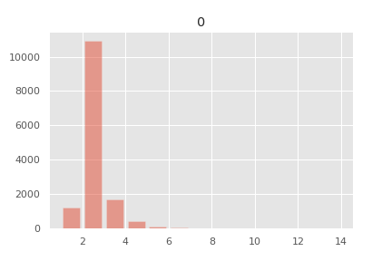

|最大停留点 |サンプル数（人）|備考|
|---|---|---|
|第1停留点まで   |1188  |自宅にずっと滞在|
|第2停留点まで   |21860 |自宅と職場（一箇所）のみ|
|第3停留点まで   |5070  |
|第4停留点まで   |1600  |
|第5停留点まで   |595   |
最大停留点21点まで

##### 全サンプルにおける停留時間
縦軸：サンプルID数、横軸：停留時間(分)
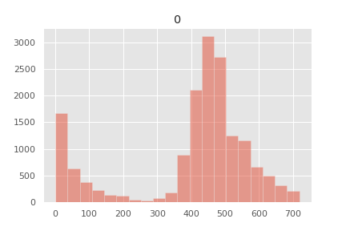

##### 全サンプルにおける停留日時
縦軸：サンプルID数、横軸：停留日時（0:00→0分, 11:59→1439分）
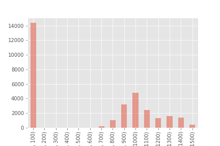

##### 各域内トリップとサンプル数
|最大停留点 |サンプル数（人）|備考|
|---|---|---|
|第1域内停留点数  |791  |1 |
|第2域内停留点まで  |1116   |0.119 |
|第3域内停留点数 |857  |0.0231 |
|第4域内停留点数   |253   |0.00668 |
|第5域内停留点数 |141  |0.00209 |

| | index|	no|	start_time|	duration|
|---|---|---|---|---|
|count|	3540|	3540|	3540|	3540|
|mean	|134799|	3.059|	915.308|	320.638|
|min|	3495|	1|	1|	5|
|max|	208201	|21|	1438|	720|

##### 停留点の分布
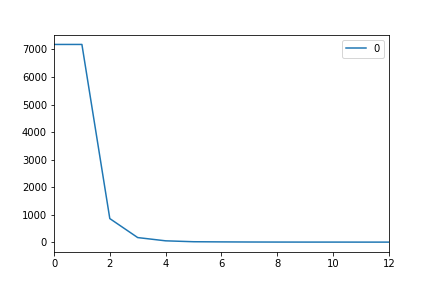

##### 停留点の分布

#### ぐるなびデータの整理
- 域内データ数　4390店舗
- ぐるなびで与えられたカテゴリー数は23
- 域内では2538店舗:1852店舗分不足
  - 課題：ナイトエコノミーの分析をする際、2538店舗分でしか行えない

店舗の分布
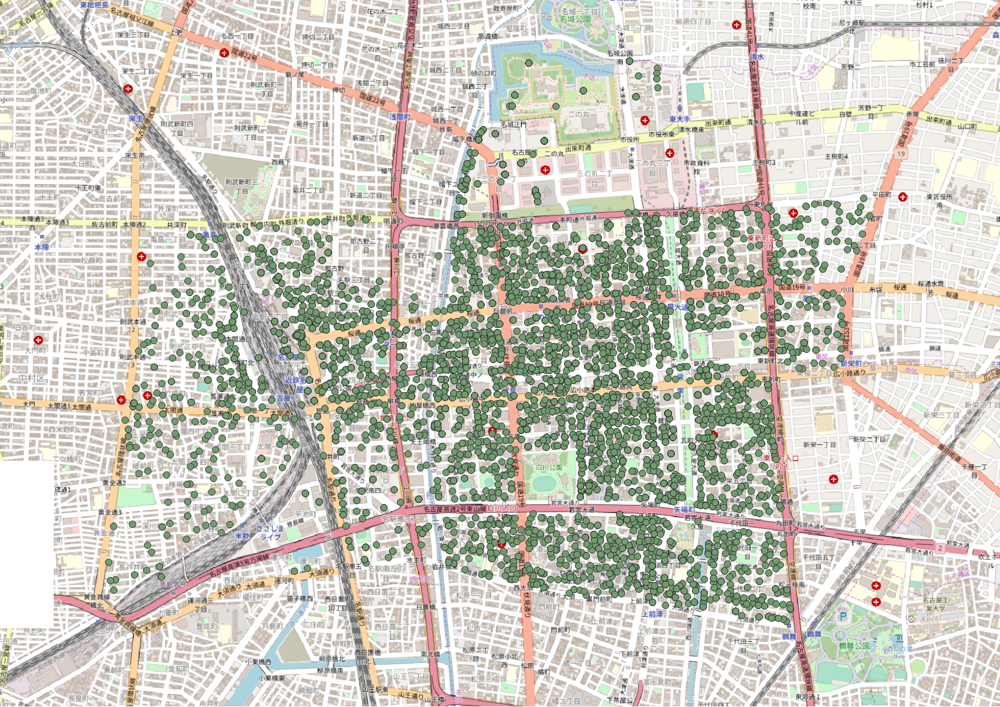

#### 分割範囲の決定

丁を元に、文献9を参考に今回の範囲を55に分割した
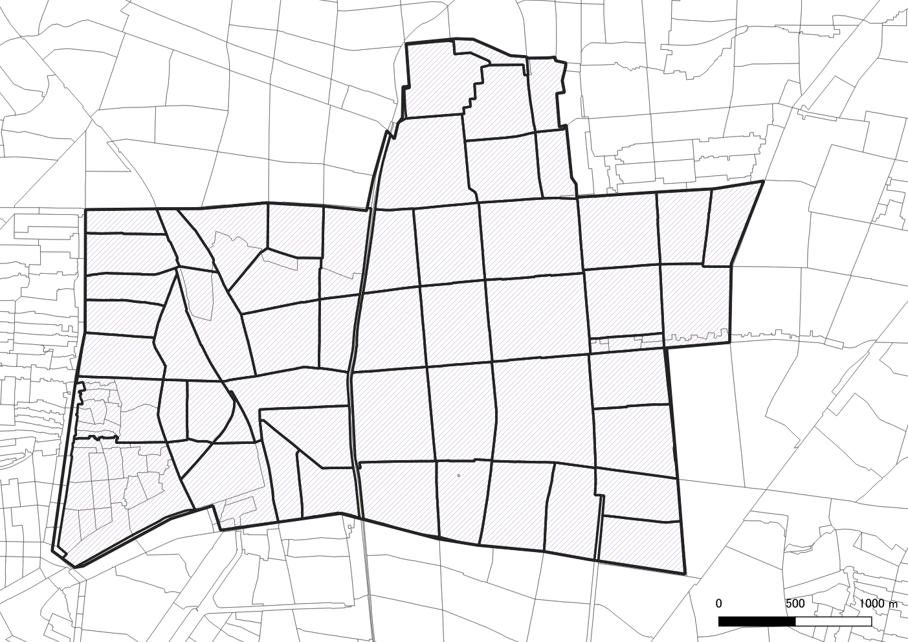

---

# 1114 松本

#### 停留点抽出の概念図

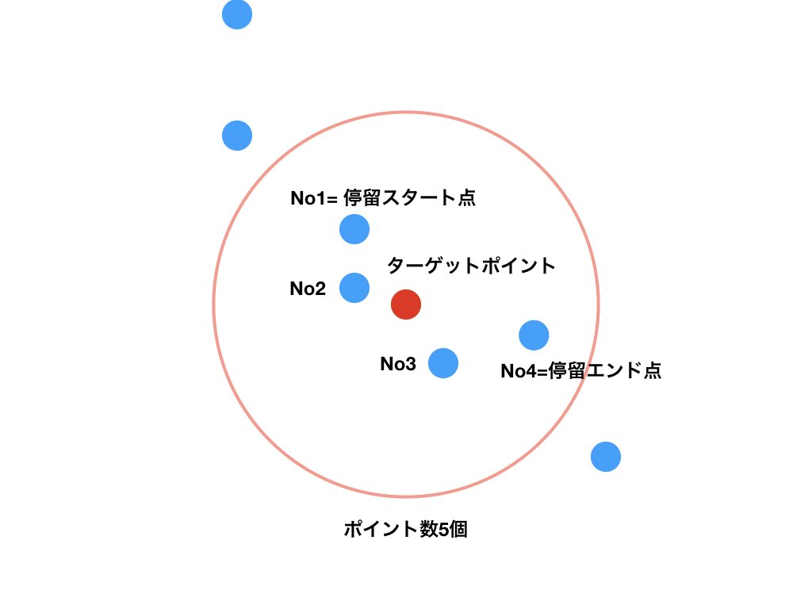

全ての点から半径25mの円を作成し、その内部の点をカウントする。
このカウント数が5つ以上の場合、25m圏内に5分以上滞在したとし、その25m圏内の点を全て抽出する。
抽出された点のうち、時刻が最も早い点を**停留スタート点**、時刻が最も遅い点を**停留エンド点**として、定義する。
この時、停留スタート点は域内トリップのトリップエンドとなり、停留エンド点は域内トリップのトリップスタートとなる。

##### 対応表
|トリップ |停留  |
|---|---|
|域内トリップスタート点  |停留エンド点  |
|域内トリップエンド点  |停留スタート点  |

停留スタート点、停留エンド点を抽出する際、その時刻と緯度経度を記録し、停留時間とトリップ距離の分析に用いる。

#### 各サンプル数
ここで全サンプル数と域内サンプル数の整理を行う。
域内データは、中区を含めた区域で一度でも停留したサンプルのことである。
##### グラフ等
|トリップ |停留  |
|---|---|
|全サンプル数  |17551  |
|全停留サンプル数   |14398   |
|域内停留サンプル数  |6326  |

##### 全サンプルにおける停留回数
縦軸：停留回数、横軸：サンプルID

##### 全サンプルにおける停留回数
縦軸：サンプルID数、横軸：停留回数
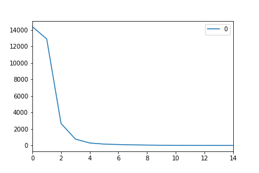

##### 各域内トリップとサンプル数
|域内トリップ |域内停留サンプル数  |域内停留サンプル数/総サンプル数(7182) |
|---|---|---|
|第1域内停留点数  |7182  |1 |
|第2域内停留点数  |856   |0.119 |
|第3域内停留点数 |166  |0.0231 |
|第4域内停留点数   |48   |0.00668 |
|第5域内停留点数 |15  |0.00209 |
|第6域内停留点数   |9   |0.00125 |
|第7域内停留点数   |5   |0.000696 |
|第8域内停留点数   |3   |0.000418 |
|第9域内停留点数   |2   |0.000278 |
|第10域内停留点数   |2   |0.000278 |
|第11域内停留点数   |1   |0.000139 |
|第12域内停留点数（最大）   |1   |0.000139 |

##### 停留点の分布

##### 停留点の分布

#### ぐるなびデータの整理
- 全データ数　13688店舗
- 域内データ数　4515店舗
- 全データの時間を提供されている店舗は5755店舗（域内では2538店舗:1932店舗分不足）
  - 課題：ナイトエコノミーの分析をする際、2538店舗分でしか行えない

店舗の分布

#### スケジュール
11月4週目：中京都市圏PT調査との付き合わせ,ぐるなびデータを時間帯別に分けるq
11月5週目：ぐるなびデータを時間帯別に分ける（1932店舗分を人力で埋める？）
12月1週目：商業集積地データ、建物現況調査データを整理する（カテゴリーに分ける）
12月2週目：メッシュと停留点と商業集積地データを対応させる（同一店舗数を決める）
#### ここまでで8章まで終了

12月3週目：各トリップでの多項ロジット分析（サンプル数を100程度までにランダムサンプリングしたい）

---

# 1107 松本

#### 範囲決定
- 現在、停留点の抽出の定義づけ部分を行っている。
  - 区域を広げたため、通過サンプルも含め、関連するサンプルが増えたので、ランダムサンプリングを行い、サンプル数を減らすことで、停留点の定義づけを行う。
  - 下図のように全ポイント(17551サンプル)で抽出するのは時間がかかりすぎて現実的な作業ではないことが判明

    - まず設定区域を通過も含めたサンプルを抽出
    - 次にサンプルの1%をランダムに抽出する（この数字は抽出率は総サンプル数による）
      - そのため現在は設定区域でのサンプル抽出を行っている。
        - その後1.4万サンプルになったため、1%のランダムサンプルを行い、140サンプルで定義づけを行う

##### 各サンプルの一日の動き
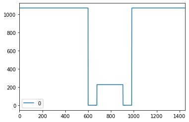
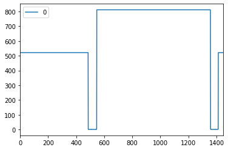
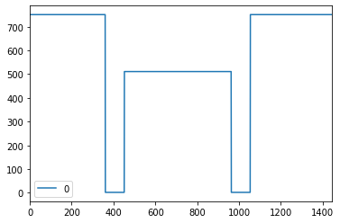
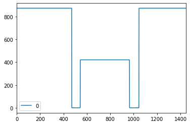
---

- 既往研究のサンプル時空間ポイントデータでの既往研究を見つけたので、追加予定

- WebAPIについて、2011年の既往研究では使われているが、人の流れデータサイトでAPIの問い合わせについて答えられないと書いてあるため、実質利用ができない
- →秋山先生か担当研究室（関研究室）に問い合わせ？

- 中京圏サンプル時空間ポイントデータは約25万人
- そのうち提供されているサンプル数は約1.6万人

---
# 1024

#### 章構成
- 背景と目的
  - 既往研究
    - 人の流れデータにおける既往研究
        - Jorasから参照
    - 店舗選択モデルの既往研究
        - 兼田研究室でのモデル、桜井モデル、石橋モデル
- 人の流れデータを用いた滞留分析
  - 人の流れデータの基本的特性
      - PT調査との関係（中京圏PT調査報告書から引用）
      - 滞留範囲と滞留時間とID数の関係
      - 滞留の定義付け（3.1.2の結果を受けて決定）
  - 人の流れデータの分析
      - 各トリップごとのID数
      - ID数/メッシュの密度の計算（のちのシミュレーション用途への）
（実世界データとの付き合わせ→Liu調査？）
  - 考察
- 多項ロジットモデルを用いたメッシュ選択分析
  - 多項ロジット選択モデルの概要
  - 多項ロジットモデル式
  - 多項ロジットに使うデータベース
  - 対数最尤法によるパラメータ推定（準ニュートン法など）
  - 域内トリップへの拡張
- 多項ロジット選択モデル分析
  - データのクリーニング
  - 各域内トリップのパラメータの推定結果
  - 各パラメータの妥当性の評価
  - 域内トリップでの多項ロジット選択モデルを用いた予測結果
- 考察
  - 考察とシミュレーター開発への展望

・参考文献
1)櫻井 雄大, 宮崎 慎也, 藤井 明, 多項ロジットモデルを用いた商業集積地に対する選択行動モデルの構築と商圏の分析, 都市計画論文集, 2011, 46 巻, 3 号, p. 427-432
2)池谷 直樹, 谷本 潤, 萩島 理, 相良 博喜, マルチエージェント・シミュレーションに基づく都心部における人口分布の過渡的動態モデルに関する研究, 日本建築学会技術報告集, 2007, 13 巻, 26 号, p. 845-848
3)正光 将大, 兼田敏之, ダイナミックシミュレータを用いた中心商業地の持続性のシミュレーション分析, 名古屋工業大学卒業論文, 2014
4)小嶋陽介, 兼田敏之, 名古屋圏における小売構造のモデル分析, 名古屋工業大学修士論文, 2011
5)兼田敏之, 吉田琢美, 歩行者回遊行動のエージェントモデリング, オペレーションズリサーチ12月号
6)石橋健一, 斎藤参郎, 熊田禎宣, 来街頻度に基づく販売額予測非集計回遊マルコフモデルの構築-小倉都心商業地区への適用-, 都市計画学会学術研究論文集, 1998,  第33回

さらに追加予定

PT調査　調査票数 31万人
人の流れデータ - 中京圏ID数　平日21万人
人の流れデータ - 中区抽出ID数　平日1.7万人（通過・滞留こみなので、さらに減る予定）

---
# 1017

- 背景
　名古屋市には様々な商業施設、娯楽施設、飲食店が存在し、多様な人々が来訪することで、都市への賑わいをもたらす。近年では人々の移動に関する情報はGPSログデータをはじめとするデータが提供されており、人々の行動がより詳細に得られるようになった。人々の店舗選択行動を構築することで、都心での店舗間の往来を明らかにし、都市の賑わい形成に繋がると考える。

- 既往研究
　既往研究としては、桜井らは多項ロジットモデルを使い、世田谷区における商業集積地の選択行動モデルを構築し、それぞれの商圏を分析した。
　しかし、名古屋市栄周辺では個人店舗が散らばっており、実際にこのような場所が数多く存在しているが、商業集積地を元にした手法ではモデルを作ることができない。また商圏分析に留まっており、ミクロな行動への分析へと繋げることができない。

- 目的
　そこで、本研究では人の流れデータとWeb上にある店舗データを組み合わせることで、多項ロジットモデルを用いて店舗選択行動モデルを構築し、メッシュ分割された各メッシュ内の選択確率を求める。さらに、その選択行動モデルを元に実世界でのシミュレーションをすることで、人工社会における賑わい研究の一端を模索する。

データセット(nは中区内のサンプル数)
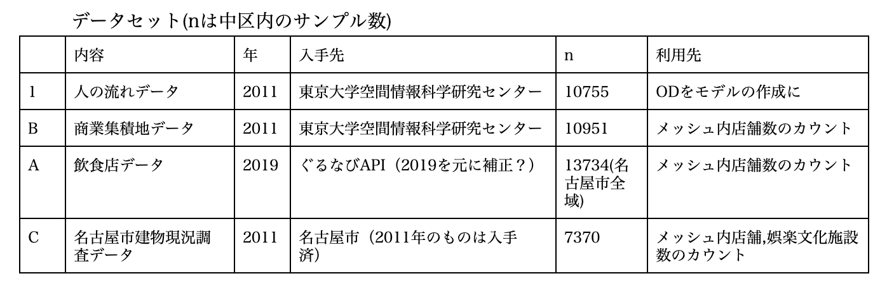

#### データの取得や整理
##### メッシュの作成
　本研究ではメッシュ間のトリップを対象に分析をするため、QGISを用いて中区全域に50mメッシュを作成した。

##### ぐるなびデータの取得
　飲食店データとして、ぐるなびに登録されている飲食店のデータを用いた。ぐるなびの飲食店データを取得する際、ぐるなびWebサービスにある開発者向けのぐるなびAPIを利用することで、各店舗の位置情報、業態といったデータを取得できる。このAPIをPythonを使って名古屋市中区にある全データを一括に取得した。

#### 人の流れデータの整理
　次に人の流れデータを整理した。人の流れデータとは、国や地方自治体等で調査を行っているパーソントリップ調査データ（PTデータ）から作成したデータである。データ内には1分単位の個人ごとの座標があり、本研究ではこの個人ごとの座標から滞在と見られる部分を抽出し、区域内トリップを推測した。
　滞在の抽出では、各IDごとに中区に来訪しているIDを抽出し、来訪しているIDから、同IDの各ポイントを対象に半径5m以内、5分以上の座標の移動を抽出、滞在と仮定した。
　下に各トリップでのID数を図示する。

　さらにこの滞在ポイントをメッシュ単位に変換するために、1)で作成したメッシュで滞在ポイントと重なる部分のメッシュIDを取得した。

#### 各データ間の店舗・施設の整理
　データ間で施設が重複する可能性が考えられるので、各データからどのデータを取得したか整理する。BC間では重複が多くあったので、目視にて精査した。

#### 同一分類施設数のメッシュへの挿入
　pythonを用いて50ｍメッシュごとに同一分類施設数を算出する。
　4で整理されたデータをA)飲食店・小売店、 B)ナイトサービス娯楽施設(キャバレー、ストリップ劇場、ラブホテル、映画館、ダンスホール、ディスコ、ライブハウス)、 C)デイサービス娯楽施設(マージャンクラブ、カラオケ、囲碁・将棋所、パチンコ、ゲームセンター、ボーリング場、 D)文化施設(図書館、美術館、講堂、会館、公民館、文化会館、博物館等)に分類した。
　さらに分類ごとに各メッシュ内に同一分類施設数がいくつあるかカウントし、メッシュの属性とした。

#### 各メッシュに対する個人の選択行動モデル
　本章では多項ロジットモデル(Conditional Logit Model)を効用関数としてモデルを構築し、パラメータを推定する。
　パラメータ推定にはPythonのパッケージであるScipyのOptimize関数Powell法を用いて、対数最尤関数のパラメータ推定を行う。

#### 選択行動モデルの構築
個人iが店舗jから受ける効能を同一店舗種Rjと距離dijとの線形式で表すと仮定すると、効用関数は

uij = kRj - dij

と表され、このパラメータを推定することで、個人の効用を表す。
α、βはパラメータ、距離dijは個人iが存在する地点からメッシュjまでのマンハッタン距離でを採用する。これは、名古屋市の中区は碁盤目状になっているためである。
個人の選択確率は

Pij = exp(u)kexp(u)

となり、メッシュが選択される確率を算出することができる。
　
　サンプリングされた標本者の選択行動が現れる確率Lはそれぞれの選択確率の積で表されるので、その対数をとり

ln L = j = 1nj = 1Jln Pij

対数尤度関数lnLを最大にすればよく、そにそのパラメータを求めれば良い。本研究では、数値解析法の一つであり、ヤコビ行列とヘッセ行列を必要としない複雑な式に適用できるPowell法を用いて解を導き出す。

--
1. ここまでの操作はできることが確認できたので、狙いに合わせたデータの前処理や基本的な統計量について調べていきたい。
2. 数値解析については10サンプル程度では瞬時に終了することがわかったので、徐々にサンプル数を増やし、PC性能との限界や数値解析手法を変えたりすることで、500サンプル程度を目標にしたい。
3. また同一店舗種ではなく、同一店舗床面積といった別の切り口もできないか考えている。

- 構築されたモデルを用いたマルチエージェントシステムの作成
- 店舗を対象としたマルチエージェントシステムは数多くあり、特に兼田・吉田のASSAモデルではスケジューリングによる回遊行動を考案している本研究でのシミュレーションでは兼田・吉田のASSAモデルをベースに考える。また石橋・斎藤モデルを読み込み、回遊モデルへと利用できないかと模索する予定。

・参考文献
1)櫻井 雄大, 宮崎 慎也, 藤井 明, 多項ロジットモデルを用いた商業集積地に対する選択行動モデルの構築と商圏の分析, 都市計画論文集, 2011, 46 巻, 3 号, p. 427-432
2)池谷 直樹, 谷本 潤, 萩島 理, 相良 博喜, マルチエージェント・シミュレーションに基づく都心部における人口分布の過渡的動態モデルに関する研究, 日本建築学会技術報告集, 2007, 13 巻, 26 号, p. 845-848
3)正光 将大, 兼田敏之, ダイナミックシミュレータを用いた中心商業地の持続性のシミュレーション分析, 名古屋工業大学卒業論文, 2014
4)小嶋陽介, 兼田敏之, 名古屋圏における小売構造のモデル分析, 名古屋工業大学修士論文, 2011
5)兼田敏之, 吉田琢美, 歩行者回遊行動のエージェントモデリング, オペレーションズリサーチ12月号
6)石橋健一, 斎藤参郎, 熊田禎宣, 来街頻度に基づく販売額予測非集計回遊マルコフモデルの構築-小倉都心商業地区への適用-, 都市計画学会学術研究論文集, 1998,  第33回
